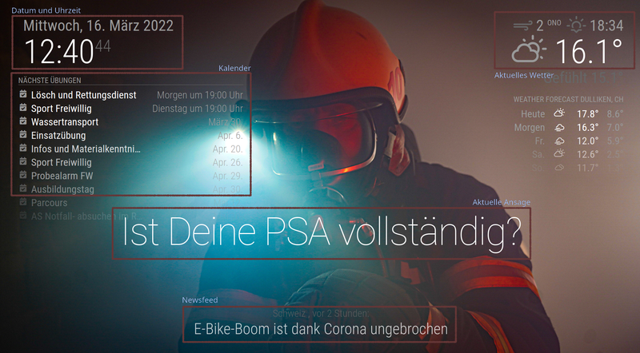
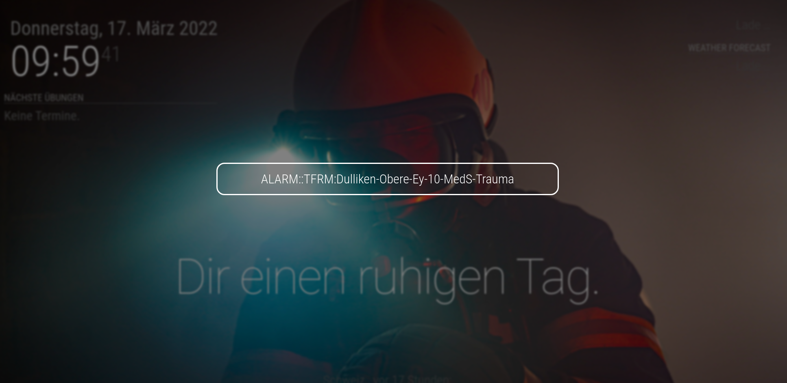

# Feuerwehr Infoscreen

Ziel dieses Projekts ist die Erstellung eines Infoscreens für ein Feuerwehrmagazin, das relevante Informationen darstellt, die sich nach dem jeweiligen Übungs- und Einsatzbetrieb richten.

## Features

- Kalendervorschau mit den kommenden Übungen
- Wetterinformationen für die Region
- Individuelle Meldungen und Ankündigungen
- Aktuelle Nachrichten
- Darstellung von Alarmmeldungen im Einsatzfall
- "Diashow" mit wechselnden Hintergrundbildern bei öffentlichen Veranstaltungen


*Abbildung 1 -- Screenshot im Übungsmodus*


*Abbildung 2 -- Screenshot im Alarmmodus*


Weitere Möglichkeiten können über die Installation zusätzlicher Module installiert werden.

## Hardware-Plattform

Der Infoscreen besteht aus einem handelsüblichem Fernsehbildschirm und einem Kleincomputer ([Raspberry Pi](https://de.wikipedia.org/wiki/Raspberry_Pi), im Folgenden kurz "Pi" genannt). Der Pi übernimmt folgende Aufgaben:

- Anzeige der Informationen
- ggf. Sprachausgabe
- Ansteuerung des Bildschirms (Ein-/Ausschalten)
- Verbindung zum Internet und einholen der darzustellenden Informationen
- Integration mit Sensoren (Bewegungsmelder, etc.)

## Software

Die Software zur Darstellung der Informationen ist [MagicMirror](https://magicmirror.builders/). Diese ist frei zugängliche Open-Source-Software, die für den vorgesehenen Einsatz nach Belieben modifiziert werden kann.

### Installation

Der Pi wird mit einer aktuellen Version des Raspbian-Betriebssystems vorbereitet und mit dem WLAN-Netzwerk verbunden. Der Anschluss an den Fernseher erfolgt über die HDMI-Schnittstelle.

Die Installation der Software ist im [Handbuch](https://docs.magicmirror.builders/getting-started/installation.html) (englisch) ausführlich beschrieben. Ich habe die Variante "Manual Installation" gewählt, da diese die beste Kontrolle über die Konfiguration gewährleistet.

Um den automatischen Start beim Einschalten zu gewährleisten, ist es notwendig, den PM2 Process Manager zu installieren und zu konfigurieren, wie im [Konfigurationshandbuch](https://docs.magicmirror.builders/configuration/autostart.html) beschrieben.

Die Konfiguration der Module erfolgt über die Datei `config/config.js` im MagicMirror-Verzeichnis. Eine aktuelle Konfiguration für die [Feuerwehr Dulliken](https://lodur-so.ch/dulliken/) befindet sich in der Versionsverwaltung.

Je nach Bildschirmgrösse muss ggf. die Schriftgrösse der Anzeige angepasst werden. Dies geschieht in der Datei `css/custom.css`.

### Konfiguration

#### Kalender-Abo

Die Ankündigungen der Übungen werden aus dem Lodur-System mittel Kalenderabo (ICS) heruntergeladen. Dazu ist der URL des Kalenders in der Konfiguration einzutragen:

```
{
	module: "calendar",
	header: "Nächste Übungen",
	position: "top_left",
	config: {
		calendars: [
			{
				symbol: "calendar-check",
				url: "https://lodur-so.ch/dulliken/tunnel.php?modul=426&key=200xxxxxxxxxxxxxxxxEE"
			}
		]
	}
},
```

### Zusatzmodule

Die aktuell verwendeten Module sind im Lieferumfang der Grundversion vorhanden. An [Zusatzmodulen](https://github.com/MichMich/MagicMirror/wiki/3rd-party-modules) sind installiert:

- [MMM-EasyBack](https://github.com/mykle1/MMM-EasyBack) zur Darstellung des Hintergrundbilds
- [MMM-RemoteControl](https://github.com/Jopyth/MMM-Remote-Control) zur Darstellung von Alarmmeldungen von externen Systemen.

#### Bildschirmhintergrund

Im Verzeichnis `/modules/MMM-EasyBack/images` können Bilder hochgeladen werden, die im Hintergrund angezeigt werden sollen. Dabei ist darauf zu achten, dass das Seitenverhältnis des Bildes mit dem des Fernseher übereinstimmt, damit es keine schwarzen Ränder unten oder rechts gibt. Welches Bild angezeigt wird, legt man in der Konfiguration des Moduls fest:

```
{
	module: 'MMM-EasyBack',
	position: 'fullscreen_below',
	config: {
		bgName: "atemschutz.jpg"
	}
}
```

Wie aus der Dokumentation ersichtlich, kann man auch YouTube-Videos im Hintergrund laufen lassen.

## Integration

Der Infoscreen kann mit verschiedenen Hard- und Softwaresystemen verbunden werden. Die einzelnen Möglichkeiten werden hier nach und nach ergänzt.

### HDMI

Das Ein- und Ausschalten des Fernsehers erfolgt etwas umständlich über [CEC-Kommandos](https://pimylifeup.com/raspberrypi-hdmi-cec/), diese müssen installiert sein.

```bash
# Fernseher in den Standby-Modus
echo 'standby 0' | cec-client -s -d 1

# Fernseher einschalten
echo 'on 0' | cec-client -s -d 1
```

Diese Kommandos sollen künftig über den Bewegungsmelder ausgelöst werden. Das ist aber aktuell nicht implementiert.
